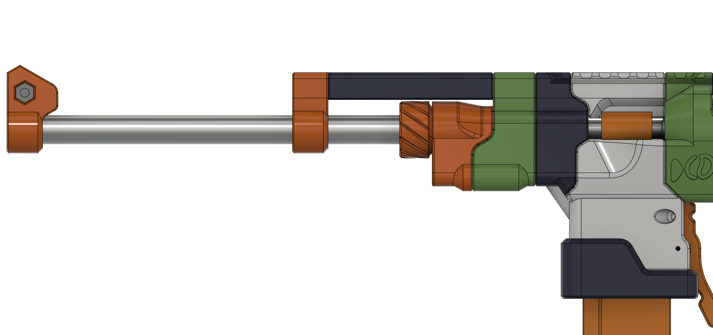
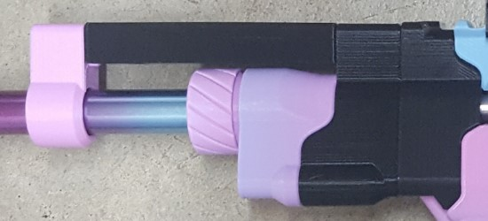
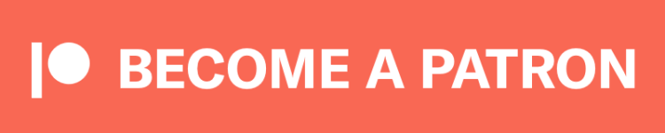
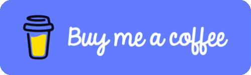

# SkewerBarrelScrewCollet
An improved barrel retention collet for the Skewer by Charamile Designs.

## I ALSO UPLOAD TO PRINTABLES https://www.printables.com/model/875222-skewer-barrel-collet

## Description

This still uses the 016 o-ring from the original Skewer collet, it just makes the barrels stay in way better, and makes barrels quick swappable.

## Printing

All STLs were exported in print orientation.

Print at 20% infill, 5 walls.

## Misc.

**If you build any of my designs, I'd love to see yours! Feel free to message me on Discord (Sillybutts#5905) or tag me on a post on Reddit (u/SillyTheGamer).**

**If you are having issues with any of my designs, let me know on Discord (Sillybutts#5905) or Reddit (u/SillyTheGamer).**

**If you wish to print and sell this item, please contact me for licensing. I can be reached on Discord (Sillybutts#5905) or Reddit (u/SillyTheGamer).**

 This work is licensed under a <a rel="license" href="http://creativecommons.org/licenses/by-nc-sa/4.0/">Creative Commons Attribution-NonCommercial-ShareAlike 4.0 International License</a>.

## If you like what I do, please consider supporting me!

**I don't charge for my files, so any donations or merch purchases would be greatly appreciated!**

 https://www.redbubble.com/people/Sillybutts/shop RedBubble full of fun Nerf-y sticker and merch designs!  

 https://www.patreon.com/sillybutts 

 https://www.buymeacoffee.com/sillybutts 

And here's my Etsy: https://www.etsy.com/shop/sillybuttsshop

## Images

